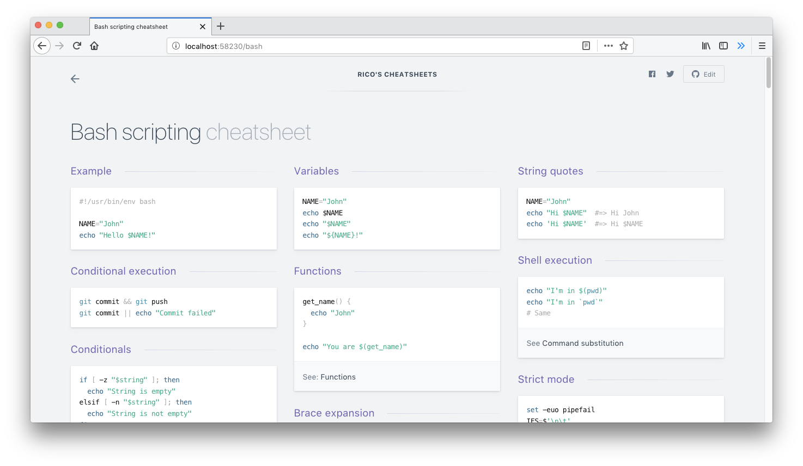

# Dashints

> TL;DR for developer documentation - a ridiculous collection of cheatsheets

 

 
✨ <b><a href='https://dashints.dev/'>dashints.dev</a></b> ✨

 

---

See [CONTRIBUTING.md](CONTRIBUTING.md) for developer notes.

